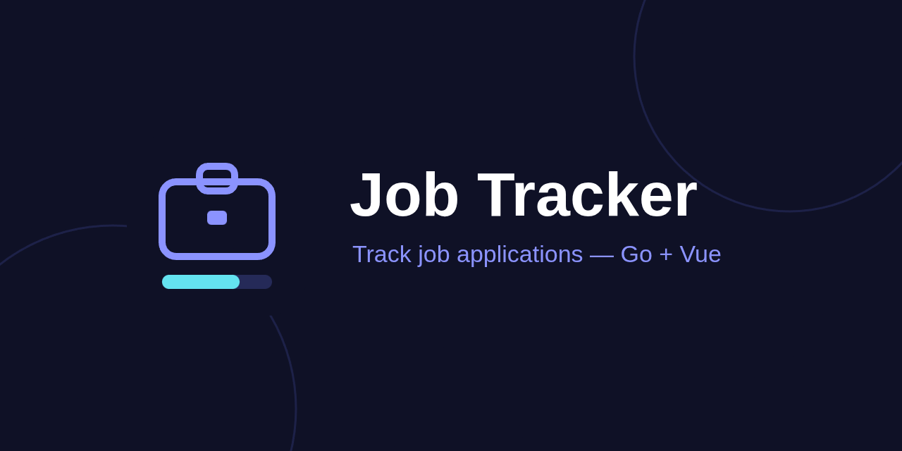

# Job Tracker



[](https://jobtracker.tecnologer.net)

Own your job search — open-source, local-first job tracker. Go REST API + Vue 3 SPA.

Job Tracker keeps every application you send in one place and shows you where
each one stands:

- **Applications** — company, position, salary, links, notes, and a "top match"
  flag; filter and search the list, export it to CSV.
- **Custom pipeline stages** — define your own stage templates (Applied,
  Screening, Interview, Offer, …); each job gets its own copy you can tweak.
- **Stage history** — every stage change is logged with a timestamp, so you can
  see how an application progressed over time.
- **Contacts & meetings** — recruiters/interviewers per job, plus scheduled
  meetings with an upcoming-meetings view.
- **Dashboard** — KPIs, status breakdown, stage funnel, and average time spent
  per stage.
- **Dark mode**, because of course.

Everything is stored in a single SQLite file — no external services. It ships
in two flavors from the same codebase: a self-hosted **web app** (Basic Auth)
and a **native desktop app** (Wails) with no auth and no network listener.

## JobTracker Pro (coming soon)

The Community edition — this repo — stays free and open source (AGPL-3.0) with
all of its current tracking features. **JobTracker Pro** is an optional paid
upgrade that funds development of both editions: a one-time purchase with a
license key, no subscription.

Planned Pro features (in development):

- **One-click browser clipper** — save a job posting from any site.
- **Calendar / ICS reminders** — meetings and follow-ups in your own calendar.
- **Résumé match score** — offline résumé-to-job-description matching.
- **Advanced analytics** — deeper funnel and timing insights.
- **Document vault** — résumés, cover letters, and offers per application.
- **Priority support.**

Pro keeps the same local-first design as Community: your data stays on your
machine, no telemetry.

**Founder pre-orders are open now** at an early-access price; the Pro desktop
app ships **October 2026**. Not ready to commit? The same page has a
no-commitment waitlist.

→ **[Pre-order Pro or join the waitlist](https://jobtracker.tecnologer.net)**

## Download (desktop app)

Prebuilt desktop builds are published on the
[Releases page](https://github.com/tecnologer/jobtracker/releases):

- **Linux** — `jobtracker-desktop-linux-{amd64,arm64}.tar.gz`
- **Windows** — `jobtracker-desktop-windows-{amd64,arm64}-setup.exe` installer
- **macOS** — `JobTracker-darwin-arm64.dmg`

No setup required — data is stored in your OS user data directory. If you'd
rather run the web version or build from source, read on.

## Live demo

Try it at https://aap.jobtracker.tecnologer.net/ — log in via the browser's Basic Auth prompt:

- **User:** `demo@tecnologer.net`
- **Password:** `>J0bTr4ker.v2<`

## Screenshot


## Authentication

The entire app — all `/api/*` routes and the static SPA — is gated behind HTTP
Basic Auth. Credentials are read from two required environment variables at
startup; the server refuses to start (`log.Fatal`) if either is unset:

| Variable        | Description                                      |
| --------------- | ------------------------------------------------ |
| `AUTH_EMAIL`    | Basic Auth username (the login email).           |
| `AUTH_PASSWORD` | Basic Auth password.                             |

The browser's native login dialog handles the prompt — there is no custom login
UI. The only unauthenticated route is `GET /healthz`, which returns `200 ok` for
container healthchecks.

```bash
AUTH_EMAIL=you@example.com AUTH_PASSWORD=secret go run .
```

## Run manually

**Requirements:** Go 1.22+, Node 20+

```bash
# Terminal 1 — backend
go run .

# Terminal 2 — frontend (dev, with hot reload)
cd web && npm install && npm run dev
```

Open http://localhost:5173. Vite proxies `/api` to `:8080`.

The SQLite database is created at `jobs.db` on first run. Override with:

```bash
DB_PATH=/path/to/jobs.db go run .
```

### Production build

```bash
cd web && npm run build   # outputs web/dist/
go build -o jobtracker .
./jobtracker              # serves everything on :8080
```

---

## Docker Compose (dev, hot reload)

```bash
docker compose up
```

Go backend uses `air` for hot reload; Vite frontend at http://localhost:5173. DB is `jobs_test.db` (set via `DB_PATH` in `docker-compose.yml`).

---

## Docker

```bash
docker build -t jobtracker:latest .
docker run -p 8080:8080 -v jobtracker-data:/data -e DB_PATH=/data/jobs.db jobtracker:latest
```

Open http://localhost:8080.

---

## Kubernetes

The manifest at `k8s/jobtracker.yaml` creates a PVC (1 Gi), a Deployment, and a ClusterIP Service.

> SQLite is single-writer — replicas is fixed at 1.

### Deploy

```bash
# Build and load the image into your cluster (minikube example)
minikube start
docker build -t jobtracker:latest .
minikube image load jobtracker:latest   # skip if using a registry

# Apply
kubectl apply -f k8s/jobtracker.yaml

# Verify
kubectl get pods -l app=jobtracker
kubectl logs -l app=jobtracker
```

### Access

The Service is `ClusterIP`. Expose it locally with:

```bash
kubectl port-forward svc/jobtracker 8080:80
```

Then open http://localhost:8080.

For a real ingress, add an Ingress resource or change the Service type to `LoadBalancer`.

### Teardown

```bash
kubectl delete -f k8s/jobtracker.yaml
```

The PVC is deleted with it. To keep your data, remove the PVC from the delete command:

```bash
kubectl delete deployment,service jobtracker
```

## Desktop build

A Wails v2 desktop target (`cmd/desktop`) packages the same backend and
frontend as a native app: no basic auth, no network listener, SQLite lives in
the OS user data dir (override with `DB_PATH`).

```bash
cd web && npm run build   # embedded via web/embed.go, must run first
go build -tags desktop,production,webkit2_41 -o jobtracker-desktop ./cmd/desktop
./jobtracker-desktop
```

Requires the `webkit2gtk-4.1` runtime on Linux (the `webkit2_41` build tag
matches it; omit the tag only if `webkit2gtk-4.0` is installed instead).
Windows and macOS builds drop `webkit2_41` (see
`.github/workflows/release.yml`, which builds and publishes all three OSes on
tag push).

## Deploy to Railway

Railway builds from the repo-root `Dockerfile` (config in `railway.toml`), which
builds the Vue frontend and Go binary and serves both on `:8080`.

- **Volume**: mount a persistent volume (e.g. at `/data`) for the SQLite file.
- **`DB_PATH`**: set to a path inside that volume, e.g. `/data/jobs.db`, so data
  survives redeploys.
- **`AUTH_EMAIL` / `AUTH_PASSWORD`**: set the basic-auth credentials (see
  `.env.example`).
- **Healthcheck**: `/healthz` (no auth required).
- **Replicas**: keep at **1** — SQLite is single-writer and must never scale out.
